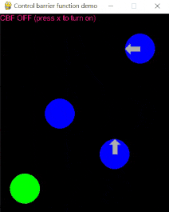
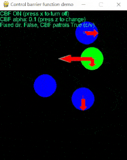

# CBF-QP Safety Filter Playground

## Description
This Python program demonstrates the use of control barrier functions (CBFs) for safe robot control in a simple 2D environment. The program simulates a controllable green robot navigating through a scenario with stationary and patrolling robots. CBFs are employed to avoid collisions between the green robot and other robots in the environment.


 

(Left: w/o safety filter; Rught: w/ safety filter)

## Dependencies
The program was develop[ed and tested in the following environment.
- Python 3.6+
- `torch==1.8.1+cpu` (optional)
- `osqp==0.6.2.post8`
- `pygame==2.3.0`
- `numpy==1.16.6`
- `scipy==1.1.0`

## Usage
### Execution
Run `demo.py` to start the simulation. A simple version w/ code generation is provided as `demo_codegen_osqp.py`.
```bash
python demo.py  # or python demo_codegen_osqp.py
```
### Controls
- Arrow keys: Control the green robot's movement.
- X: Toggle CBF ON/OFF.
- Z: Cycle through different CBF alpha values.
- C: Change the settings of constraints on filtered control.
- V: Enable/Disable safety filter of blue robots.

## Program Overview
The program consists of the following classes and files:

- `Robot`: A class in `robot.py` representing a robot in the environment. It includes methods for controlling the robot and detecting collisions.
- `SimpleRobotDynamics`: A class in `models.py` defining the dynamics of the robot. It includes methods for calculating state transition, control barrier functions, and the derivatives of control barrier funcitons.
- `demo.py`: The entry point of the program that handles user input, robot movement, collision detection, and rendering.
- `utils.py`: This file contains a helper function to draw the robots on the screen.

## CBF-QP Safety filter
The safety filter based on CBF-QP aims to modify a user's command (desired control input) to satisfy system constraints while keeping the modification minimal. The optimization problem of the safety filter is given below. 

```math
\begin{aligned}
& \underset{u} {\text{minimize}} &&\left\| u-u_{nom} \right\|^2 + k\delta^2\\
&\text{s.t.} && \dot{h}(x, u)\ge  -\alpha \cdot h(x)-\delta\\
& &&u_{min} \le u \le u_{max}\\
& && 0 \le \delta \le \inf
\end{aligned}
```
where $u_{nom}$ is the nominal control input given by user. $u=[u_x, u_y]$ is the output of safety filter. $x=[p_x, p_y]^T$ is the X and Y position of the robot. $h(x)$ is the control barrier function. $\delta$ is the slack variable.

The dynamic of the robot is as follow.
```math
\dot{x}=
\begin{bmatrix}
\dot{p_x} \\
\dot{p_y}
\end{bmatrix}
=
\begin{bmatrix}
u_x \\
u_y
\end{bmatrix}\\
```

## References
- [制御バリア関数(CBF)を使えるようになろう](https://qiita.com/seria_hina/items/afd96b930ade860926bc)
- [EECS C106B/206B Robotic Manipulation and Interaction, Spring 2023](https://ucb-ee106.github.io/106b-sp23site/) (Week 10 - Finishing Grasping, CBFs)
- Ames, Aaron D., et al. "Control barrier functions: Theory and applications." 2019 18th European control conference (ECC). IEEE, 2019. ([arxiv](https://arxiv.org/abs/1903.11199))
