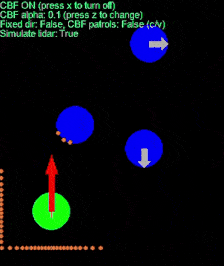

# CBF-QP Safety Filter Playground

## Description
This Python program demonstrates the use of control barrier functions (CBFs) for safe robot control in a simple 2D environment. The program simulates a controllable green robot navigating through a scenario with stationary and patrolling robots. CBFs are employed to avoid collisions between the green robot and other robots in the environment. When safety filter is activated, it modified the user command to prevent collision while keeping the modification minimal.


  

- Left: w/o safety filter
- Middle: w/ safety filter using GT obstacle position
- Right: w/ safety filter treating lidar points as obstacles

## Key Features
#### CBF-QP Ssafety filter
Implements a CBF-based optimization to minimally adjust control inputs, ensuring the robot remains within safe distance defined by the barrier function to prevent collision.
#### Sumulated LiDAR
Includes a 2D LiDAR sensor simulation that can be used instead of ground truth obstacle positions.
#### Pygame visualization
- Uses Pygame for visuallization, showing robots movements, the effect of the safety fiter, and (optionally) LiDAR scan points.
#### Disturbance observer
Integrates a disturbance observer of the barrier function, especially useful for handling moving obstacles.
#### Docker support
Provides a `Dockfile` and `docker-compose.yaml` for easy setup and execution.

## Usage
### Execution in docker container (recommended)
First, install Docker and Docker Compose using the [official install guide](https://docs.docker.com/engine/install/ubuntu/).

Then, clone this repository and go into the project folder
```bash
git clone https://github.com/shaoanlu/CBF_QP_safety_filter.git
cd CBF_QP_safety_filter
```
To run the application, build the docker image and launch the container (requires WSL2 if running on Windows due to support for GUI display)
```bash
docker compose up --build
```

To stop the container, execute the following command
```bash
docker compose down
```

### Execution in local environment
Run `demo.py` to start the simulation. A simple version w/ code generation is provided as `demo_codegen_osqp.py`.
```bash
python demo.py  # a PyGame window will be spawn
```

Unit test can be executed through the following command.
```bash
python -m unittest
# ----------------------------------------------------------------------
# Ran 11 tests in 0.000s
# OK
```

### Game Controls
- `Arrow keys`: Control the green robot's movement.
- `X`: Toggle CBF ON/OFF.
- `Z`: Cycle through different CBF alpha values.
- `C`: Change the settings of constraints on filtered control.
- `V`: Enable/Disable safety filter of blue robots.
- `S`: Enable/Disable simulated lidar sensor.
- `R`: Reset robot positions.

## Dependencies
The program was developed and tested in the following environment.
- Python 3.9+
- `torch==1.8.1+cpu` (optional)
- `osqp==0.6.7`
- `pygame==2.6.1`
- `numpy==1.26.4`
- `scipy==1.13.1`

## CBF-QP safety filter
The safety filter based on CBF-QP aims to modify a user's command (desired control input) to satisfy system constraints while keeping the modification minimal. The optimization problem of the safety filter is given below. 

```math
\begin{aligned}
& \underset{u, \delta} {\text{minimize}} &&\left\| u-u_{nom} \right\|^2 + k\cdot\delta\\
&\text{s.t.} && \dot{h}(x, u)\ge  -\alpha \cdot h(x)-\delta\\
& &&u_{min} \le u \le u_{max}\\
& && 0 \le \delta \le \inf
\end{aligned}
```
where $u_{nom}$ is the nominal control input given by user. $u=[u_x, u_y]$ is the output of safety filter. $x=[p_x, p_y]^T$ is the X and Y position of the robot. $h(x)$ is the control barrier function. $\delta$ is the slack variable. $k$ and $\alpha$ are parameter to be tuned.

The dynamic of the robot is as follow.
```math
$$
\dot{x} =
\begin{bmatrix}
\dot{p_x} \\
\dot{p_y}
\end{bmatrix}
=
\begin{bmatrix}
u_x \\
u_y
\end{bmatrix}
$$
```

## References
- [制御バリア関数(CBF)を使えるようになろう](https://qiita.com/seria_hina/items/afd96b930ade860926bc)
- [EECS C106B/206B Robotic Manipulation and Interaction, Spring 2023](https://ucb-ee106.github.io/106b-sp23site/) (Week 10 - Finishing Grasping, CBFs)
- Ames, Aaron D., et al. "Control barrier functions: Theory and applications." 2019 18th European control conference (ECC). IEEE, 2019. ([arxiv](https://arxiv.org/abs/1903.11199))
- Harms, Marvin, Martin Jacquet, and Kostas Alexis. "Safe Quadrotor Navigation using Composite Control Barrier Functions." arXiv preprint arXiv:2502.04101 (2025).
- Molnar, Tamas G., and Aaron D. Ames. "Composing control barrier functions for complex safety specifications." IEEE Control Systems Letters (2023).
- Alan, Anil, et al. "Disturbance observers for robust safety-critical control with control barrier functions." IEEE Control Systems Letters 7 (2022): 1123-1128.
- Liang, Kaizhao, et al. "Cautious optimizers: Improving training with one line of code." arXiv preprint arXiv:2411.16085 (2024).