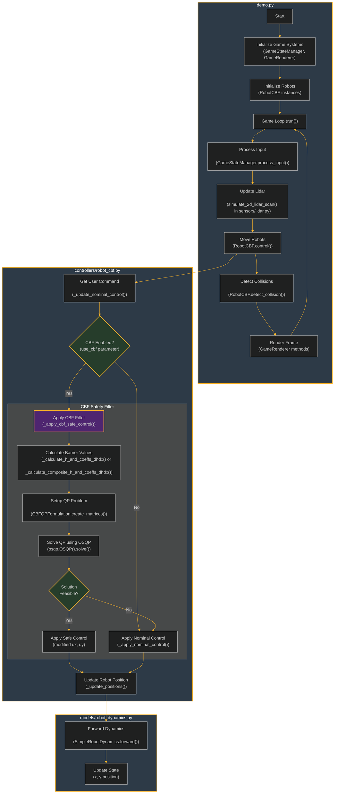

## Flowchart for controller components

```mermaid
%%{
  init: {
    'theme': 'dark',
    'themeVariables': {
      'primaryColor': '#2D3A47',
      'primaryTextColor': '#fff',
      'primaryBorderColor': '#7C0097',
      'lineColor': '#F8B229',
      'secondaryColor': '#006100',
      'tertiaryColor': '#4B0082'
    }
  }
}%%

flowchart TB
    subgraph demo.py
        Start --> InitGame["Initialize Game Systems
        (GameStateManager, GameRenderer)"]
        InitGame --> InitRobots["Initialize Robots
        (RobotCBF instances)"]
        InitRobots --> GameLoop["Game Loop (run())"]
        GameLoop --> ProcessInput["Process Input
        (GameStateManager.process_input())"]
        ProcessInput --> UpdateLidar["Update Lidar
        (simulate_2d_lidar_scan() in sensors/lidar.py)"]
        UpdateLidar --> MoveRobots["Move Robots
        (RobotCBF.control())"]
        MoveRobots --> DetectCollision["Detect Collisions
        (RobotCBF.detect_collision())"]
        DetectCollision --> RenderFrame["Render Frame
        (GameRenderer methods)"]
        RenderFrame --> GameLoop
    end

    subgraph controllers/robot_cbf.py
        MoveRobots --> GetUserCmd["Get User Command
        (_update_nominal_control())"]
        GetUserCmd --> CBFCheck{"CBF Enabled?
        (use_cbf parameter)"}
        CBFCheck -->|No| ApplyNominal["Apply Nominal Control
        (_apply_nominal_control())"]
        CBFCheck -->|Yes| CBFFilter["Apply CBF Filter
        (_apply_cbf_safe_control())"]
        
        subgraph CBF Safety Filter
            CBFFilter --> CalcBarrier["Calculate Barrier Values
            (_calculate_h_and_coeffs_dhdx() or
            _calculate_composite_h_and_coeffs_dhdx())"]
            CalcBarrier --> SetupQP["Setup QP Problem
            (CBFQPFormulation.create_matrices())"]
            SetupQP --> SolveQP["Solve QP using OSQP
            (osqp.OSQP().solve())"]
            SolveQP --> CheckFeasible{"Solution
            Feasible?"}
            CheckFeasible -->|Yes| ApplySafe["Apply Safe Control
            (modified ux, uy)"]
            CheckFeasible -->|No| ApplyNominal
        end

        ApplySafe --> UpdatePos["Update Robot Position
        (_update_positions())"]
        ApplyNominal --> UpdatePos
    end

    subgraph models/robot_dynamics.py
        UpdatePos --> ModelForward["Forward Dynamics
        (SimpleRobotDynamics.forward())"]
        ModelForward --> UpdateState["Update State
        (x, y position)"]
    end

    style CBFFilter fill:#4e2570,stroke:#F8B229,stroke-width:2px
    style CBFCheck fill:#263d2b,stroke:#F8B229,stroke-width:2px
    style CheckFeasible fill:#263d2b,stroke:#F8B229,stroke-width:2px

    classDef fileNode fill:#2D3A47,stroke:#F8B229,stroke-width:2px,color:#fff
    class demo.py,controllers/robot_cbf.py,models/robot_dynamics.py fileNode
```